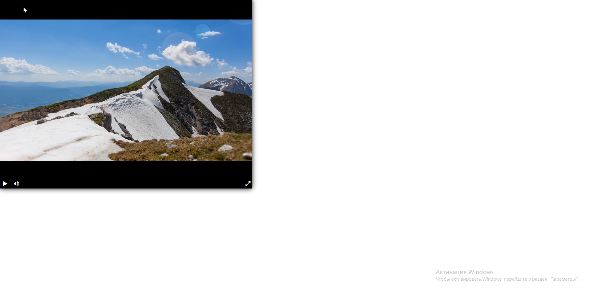

# Видеоплеер

Этот проект представляет собой видеоплеер, созданный на основе сторонней библиотеки [video-player-jslib](https://github.com/devmanorg/video-player-jslib)

### Как пользоваться

Есть два варианта, как можно открыть этот проект:
1. Открыть файл index.html в директории dist
2. Установить библиотеку livereload в командной строке командой:
```
pip install livereload,
```
а потом запустить сайт по адресу http://127.0.0.1:35729, предварительно запустив билиотеку командой:
```
livereload dist
```
Превью сайта можно посмотреть на [GitHub Pages](https://nosovegor178.github.io/Videoplayer/dist/index.html).

### Настройка

Данный проект подразумевает также возможность изменить ссылку на видео, для этого нужно перейти в файл ./dist/JS/player.js, который находится в этом проекете, и в котором необходимо изменить атрибут ***src*** функции ***createPlayer***.

### Скриншот сайта



### Цель проекта

Код написан в образовательных целях на онлайн-курсе для веб-разработчиков [dvmn.org](https://dvmn.org).